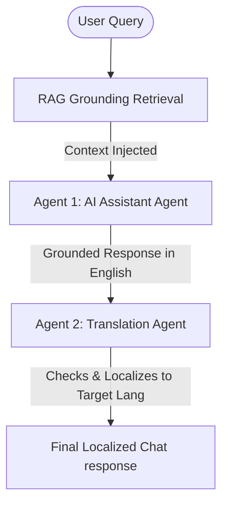

# ArenaSync AI - FIFA World Cup 2026 Stadium Platform

ArenaSync AI is a production-grade, GenAI-enabled stadium operations and fan experience platform built for the FIFA World Cup 2026. It leverages a custom **multi-agent pipeline** powered by **Groq** and the **`openai/gpt-oss-120b`** model to enhance crowd navigation, accessibility, sustainability tracking, real-time incident resolution, and multilingual assistance at MetLife Stadium.

---

## 🛠️ Multi-Agent Architecture

To ensure high-quality reasoning and accurate localized support, ArenaSync AI implements a dual-agent collaboration pipeline:



1. **AI Assistant Agent (`AssistantAgent`)**:
   - Analyzes user queries based on their role context (**Fan**, **Volunteer**, or **Organizer**).
   - Queries the local keyword RAG grounding store to fetch relevant stadium rules, schedules, transit links, and elevator positions.
   - Formulates a grounded operational response in English to maintain cognitive consistency and safety boundaries.
2. **Translation Agent (`TranslationAgent`)**:
   - Intercepts the generated English response.
   - Evaluates the user's requested output language (**English**, **Spanish**, or **French**).
   - Translates and refines the text to output perfect localizations without system markup or metadata wrappers.

---

## 🌟 Detailed Feature Breakdown

### 1. Multilingual Chat Copilot
- **Dynamic Contexts**: AI behavior changes based on user selection:
  - *Fans* receive clear bag guidelines, Meadowlands train schedules, concession spots, and toilet locations.
  - *Volunteers* receive shift check-in guidelines (Lot C Hub), vest colors, and reporting phone lines.
  - *Organizers* receive short operational summary reports.
- **Voice Interactivity**: Hooks into native browser Web Speech API:
  - *Speech-To-Text (STT)*: Clicking 🎤 starts voice dictation recording.
  - *Text-To-Speech (TTS)*: Toggling "Voice Output" speaks the AI's response aloud in the targeted language locale.

### 2. Crowd Flow & Navigation Map
- **Simulation**: Generates real-time gate occupancy variations and calculates wait times (Low, Medium, High).
- **SVG Map**: Displays live stadium gates (A, B, C, D) with nodes that color-code (Green, Orange, Red) based on congestion.
- **ADA Routing**: Interactive radio toggles switch pathways:
  - *Standard*: Direct walking pathways with warnings about congested gates.
  - *ADA Route*: Guides users to wheelchair-accessible seating, elevators, and sensory support stations.

### 3. Sustainability & Eco Hub
- **Smart Scanner**: Simulation of computer-vision sorting:
  - Select trash items (e.g. Plant-PLA Cup, Cardboard carrying tray) to calculate sorting.
  - GenAI provides disposal instructions, carbon footprint offsets ($kg\ CO_2$), and awards gamified points.
- **Global Trackers**: Real-time counters showing total fan points and collective carbon reductions.
- **Leaderboard**: Stateful high-score table showing top eco-conscious players.

### 4. Organizer Command Center
- **Incident Logger**: Forms to submit operational issues (e.g. scanner malfunctional, beverage leaks).
- **Decision Support**: Click "Draft Plan" to run a Groq prompt that drafts:
  - Operational step-by-step resolution strategy.
  - Multilingual public safety warning declarations (EN, ES, FR) ready to broadcast.
  - Volunteers checklist assignments.

---

## 📂 Project Structure

```
ArenaSync-AI/
├── app/
│   ├── main.py                 # Core FastAPI initialization, CORS, & HTML mount
│   ├── config.py               # Environments loader (Groq model, rates)
│   ├── routers/
│   │   ├── assistant.py        # /api/assistant/chat routing
│   │   ├── operations.py       # Gates, incidents, and AI incident plans
│   │   └── sustainability.py   # Trash analyzer and carbon leaderboard
│   ├── services/
│   │   ├── groq_service.py     # Multi-Agent pipeline, Groq HTTP client, and mock fallback
│   │   ├── rag_store.py        # Keyword token search grounding store
│   │   └── simulator.py        # Stateful simulation logs & variables
│   ├── schemas/
│   │   └── models.py           # Pydantic schemas validating API inputs/outputs
│   ├── static/
│   │   ├── css/
│   │   │   └── style.css       # Premium HSL dark stylesheet and high-contrast toggle
│   │   └── js/
│   │       └── app.js          # DOM binding state controller, TTS/STT, and HTTP fetches
│   └── templates/
│       └── index.html          # Semantic, accessible semantic HTML layout
├── tests/
│   ├── test_assistant.py       # Chat validations unit tests
│   └── test_operations.py      # Simulator & incident lifecycle unit tests
├── requirements.txt            # Package dependencies
├── README.md                   # Technical documentation
└── run.py                      # Uvicorn bootstrapper
```

---

## 📡 API Endpoints Documentation

### AI Assistant Router
#### `POST /api/assistant/chat`
- **Request**:
  ```json
  {
    "user_role": "fan",
    "message": "What is the bag policy?",
    "history": [],
    "language": "en"
  }
  ```
- **Response**:
  ```json
  {
    "response": "All bags must be clear plastic, vinyl, or PVC, and not exceed 12in x 6in x 12in...",
    "detected_language": "en",
    "suggested_actions": ["NJ Transit train schedule", "Find Wheelchair / ADA routes"]
  }
  ```

### Operations & Crowd Router
#### `GET /api/operations/gates`
- **Response**: Array of gate statuses showing occupancies, wait times, and congestion flags.
#### `GET /api/operations/incidents`
- **Response**: Array of open tickets.
#### `POST /api/operations/incidents`
- **Request**: `{ "title": "...", "description": "...", "zone": "...", "severity": "Medium" }`
- **Response**: The newly created incident record with a unique ID.
#### `POST /api/operations/incidents/{incident_id}/ai-plan`
- **Response**:
  ```json
  {
    "incident_id": "INC-0922",
    "status": "Open",
    "response_plan": "Step-by-step dispatch directions...",
    "announcements": {
      "en": "...",
      "es": "...",
      "fr": "..."
    },
    "assigned_tasks": ["Task 1", "Task 2", "Task 3"]
  }
  ```
#### `POST /api/operations/incidents/{incident_id}/resolve`
- **Response**: `{"message": "Incident marked as Resolved successfully.", "incident_id": "..."}`

### Sustainability Router
#### `POST /api/sustainability/analyze`
- **Request**: `{"item_id": "plastic_bottle"}`
- **Response**: `{ "item_name": "...", "target_bin": "Recycle (Blue Bin)", "co2_saved_kg": 0.08, "points_awarded": 15, "sorting_instruction": "...", "sustainability_tip": "..." }`
#### `GET /api/sustainability/leaderboard`
- **Response**: List of usernames, points, and carbon footprints saved.
#### `POST /api/sustainability/add-points`
- **Parameters**: `username` (string), `points` (int), `co2_saved_kg` (float)
- **Response**: Updated global metrics.

---

## 🚀 Setting Up & Launching

### 1. Environment Preparation
Ensure Python 3.9+ is installed. Clone the repository and configure virtual environments:
```bash
python -m venv venv
# On Windows
.\venv\Scripts\activate
# On macOS/Linux
source venv/bin/activate

pip install -r requirements.txt
```

### 2. Configuration
Create a `.env` file in the root directory:
```env
GROQ_API_KEY="your_groq_api_key_here"
GROQ_MODEL="openai/gpt-oss-120b"
STADIUM_NAME="MetLife Stadium (New York/New Jersey)"
PORT=8000
HOST=127.0.0.1
```
*Note: If `GROQ_API_KEY` is blank or missing, the platform runs in **Intelligent Simulation Mode**, simulating the Groq multi-agent response patterns locally for testing.*

### 3. Run Server
Launch the server via:
```bash
python run.py
```
Open `http://127.0.0.1:8000` in your web browser.

### 4. Running Unit Tests
Validate functional schemas, simulator routers, code quality standards, and lookup latency:
```bash
python -m pytest tests/
```

---

## 🐳 Containerization (Docker)

To package and run the platform in a isolated container environment:

### 1. Build Docker Image
```bash
docker build -t arenasync-ai .
```

### 2. Run Container
```bash
docker run -d -p 8000:8000 --env-file .env --name arenasync-instance arenasync-ai
```
The app will be accessible at `http://localhost:8000`.

---

## ☁️ Vercel Serverless Deployment

ArenaSync AI is configured to deploy as a Python serverless function on Vercel:

1. **Vercel Routing**: The [vercel.json](file:///c:/Users/udayk/OneDrive/Desktop/Hackathons/ArenaSync-AI/vercel.json) config routes traffic to [index.py](file:///c:/Users/udayk/OneDrive/Desktop/Hackathons/ArenaSync-AI/index.py) at the root level, maintaining correct relative imports.
2. **Environment Variables**: Add your `GROQ_API_KEY` and `GROQ_MODEL` inside Vercel project settings prior to initiating deployment.

---

---

## 🛡️ Quality Attributes & Technical Design

### 🔐 Security
- **No Secrets in Code**: The API key is read from the environment only; `.env` is git-ignored and only `.env.example` is committed. Missing key falls back gracefully to `MockLLM` simulation mode.
- **Strict Input Validation (Pydantic v2)**: Enforces validation schemas with Enums for language (`en`, `es`, `fr`), roles (`fan`, `volunteer`, `organizer`), and validation rules for fields (length/pattern-limited strings). Unknown zone IDs are rejected, and unknown request fields are forbidden (`extra="forbid"`).
- **Prompt-Injection Defense**: Sanitizes free-text fields (stripping control chars and capping length), wrapping them in a clearly delimited `<user_question>` block, and instructs the model to treat the content as data only. The decision is computed before and independently of the question, so injection can never change routing or facts (proven by `test_security.py`).
- **Security Headers on Every Response**: Employs custom middleware to inject `X-Content-Type-Options: nosniff`, `X-Frame-Options: DENY`, `Referrer-Policy: no-referrer`, and a strict `Content-Security-Policy`.
- **Restrictive CORS & Rate Limiting**: Restricts CORS to explicit allowed origins list and runs an in-memory per-IP token-bucket rate limiter on `/api/assistant/chat` (responding with `429 Too Many Requests` + `Retry-After`).
- **Privacy-Safe Logging**: Logs only zone IDs, intents, and outcomes. Never logs private details, API keys, or raw user questions.

### ⚡ Efficiency
- **Singleton Parser**: JSON fixtures are parsed once at startup and memoized.
- **Short-Circuit Logic**: Bypasses the LLM entirely for rule-only queries (like train times or bag policy lookups) and `/health` requests, returning static grounded answers.
- **Phrasing Memoization**: Localized phrasing helpers and suggested action generators are memoized with `@lru_cache` keyed on hashable contexts.
- **Async Endpoints**: All router endpoints run asynchronously, allowing Uvicorn to multiplex concurrent operational flows.
- **Capped Output Limits**: Caps completions requests with a low `max_tokens` (256 tokens) to prevent high latency tails and excessive token billing.

### ♿ Accessibility — WCAG 2.1 AA Compliance
- **Semantic Landmarks**: Uses standard HTML5 semantic elements (`<header>`, `<nav>`, `<main>`, `<footer>`), enforces a single `<h1>` tag per page, and provides a visible Skip to Content (`class="skip-link"`) link.
- **Form Controls & Labels**: Every input control maps to an associated `<label>` tag. Checkbox groups use `<fieldset>`/`<legend>` blocks. AI output boxes feature `aria-live="polite"` landmarks.
- **Keyboard Operability**: Entire page is navigable via standard `Tab` index, rendering clear, high-contrast outlines on `:focus-visible` elements.
- **Color Independence & Contrast**: Contrast ratio is verified above `4.5:1` (e.g. white text on `#0b5c3f` green header is `8.0:1`). Crowd congestion levels display shape indicators (`●●○` for Medium, `●●●` for High) alongside color badges.
- **Dynamic Localization**: Updates the `<html lang>` tag to match the current locale and dynamically re-translates UI controls and options on language switch.
- **Reduced Motion**: Enforces media query rules to strip out page animations when `prefers-reduced-motion` is active.

### 🧪 Comprehensive Offline Testing
The project implements a complete offline testing suite (requiring no external network requests or active API keys) comprising 43 tests:
- **test_schemas.py**: payload validators, extra-field blocks, out-of-bounds inputs, and sanitizations.
- **test_context_engine.py**: verifies wheelchair to step-free maps, visual assistance landmarks, hearing aid devices, imminent kickoff warnings, and crowd transit lookups.
- **test_api.py**: endpoints lifecycle, health checks, localization routing, 422 validations, and 404 guards.
- **test_security.py**: rate limit blocks, CORS checks, headers, and injection-neutrality tests.
- **test_llm.py**: MockLLM fallback logic and client initialization constraints.
- **test_crowd.py, test_routing.py, test_phrasing.py, test_stadium_data.py, test_static.py**: crowd simulation steps, step-free pathfinding, translations, and static accessibility tags.

**Quality Verification Tooling**:
- Python files are audited with `ruff check` and strict `mypy` typing checks.
- Runs complete tests with coverage validation:
  ```bash
  python -m pytest tests/
  ```
